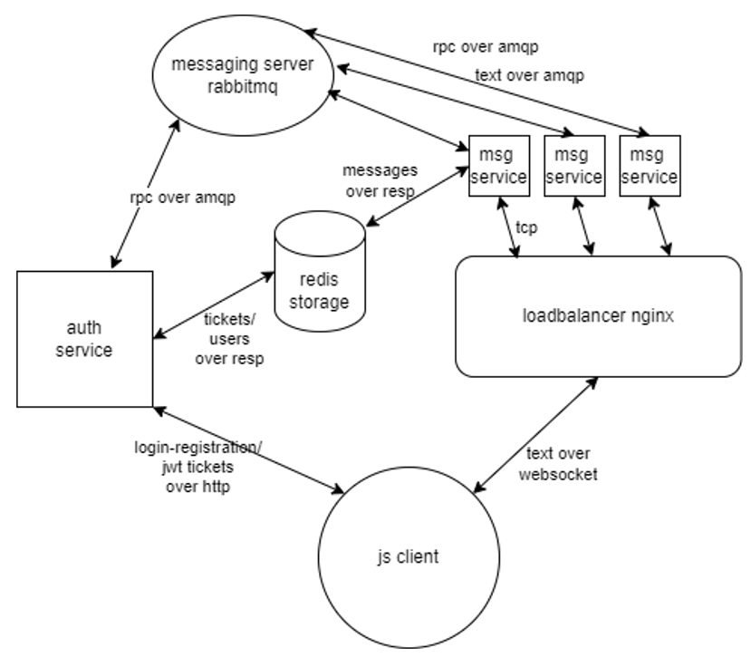

## RealTimeChat

RealTimeChat is a scalable and reliable webapp that allows users to write and recieve messages in real time. Number of core messaging services can be adjusted based on number of anticipated users.

## Design

## Basic overview

 **Auth servcie** allows users to register and login. It also issues and validates one time short-lived JWT ticket for authenticating new websocket connections to *msg servcie*.

 **Redis storage** used for caching recent chat messages, storing users logins, hashed passwords and one time tickets.

 **Loadbalancer nginx** used for loadbalancing, static content delivery and other reverse proxy capabilities.

 **Msg service** rpc calls *auth service* to authenticate new websocket connections. Recieves, validates and sends new text messages to connected clients. Broadcasts new messages to other *msg services*.

 **Messaging server rabbitmq** facilitates reliable communication between services. 
 
 Fastapi for backend services and JavaScript for simple client frontend.

 ## Technological Stack

*Python, Fastapi, Redis, Rabbitmq, Nginx, JavaScript, Docker, Websocket, RPC, JWT* 

## Setup

1. Clone the project with command `git clone ...`
2. Run `docker compose build` command in the root folder of the project
3. To start an app run `docker compose up`
4. Open *./simple_clinet/client_page.html* file in the browser to access simple app frontend. Nginx serving this contend will be configured soon...
4. To stop an app run `docker compose down`

To change amount of *msg services* working behind nginx change the `replicas` variable in the 15th row in compose.yaml file.

>*Loadbalancing Note*: Current loadbalance strategy is round-robin like. Due to the fact that all containers of the scaled service have the same name in Docker's DNS default network, Nginx can't properly use `upstream` directive to route requests. So loadbalancing occurs when each request's host resolved to different container with the help of internal network DNS.
If you need `upstream` functionalities, hardcode all services in compose.yaml or organise scaling with other technologies.

## Example
