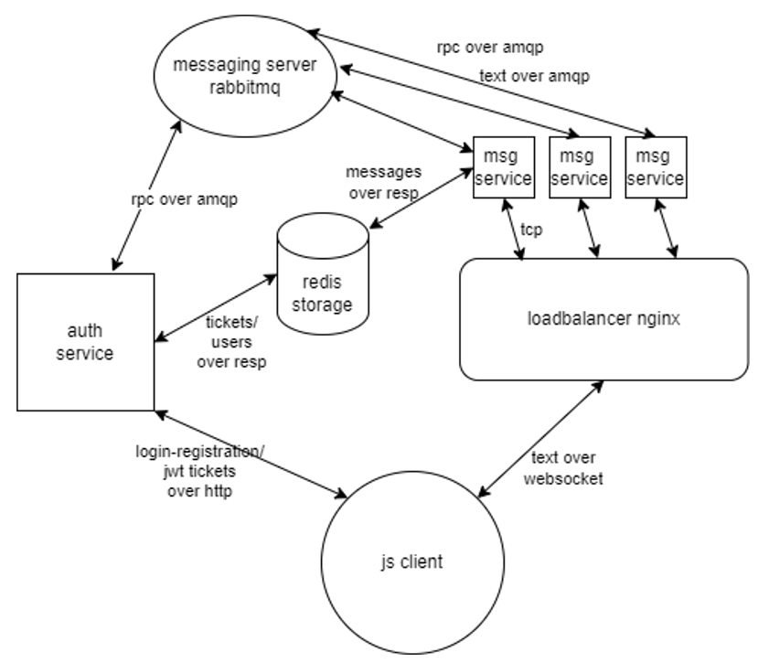

## RealTimeChat

RealTimeChat is a scalable and reliable webapp that allows users to write and recieve messages in real time. It can survive up to two chat services failure due to it distributed design.

## Design

## Basic overview

 It uses JWT as one time short-lived ticket for authenticating new WebSocket connections. Redis for caching recent messages for fast retrieval. Nginx for loadbalancing, static content delivery and other reverse proxy capabilities. Rabbitmq for reliable communication between services. Fastapi for backend services and JS for simple client frontend.

## Setup

> One of the app dependencies needs to be changed in order to create working dockerfile. Docker compose file is in the making and will be commited soon. For now no setup instruction.

## Technological Stack

*Python, Fastapi, Redis, Rabbitmq, Nginx, JavaScript, Docker, Websocket, RPC, JWT* 

## Example
Coming soon...